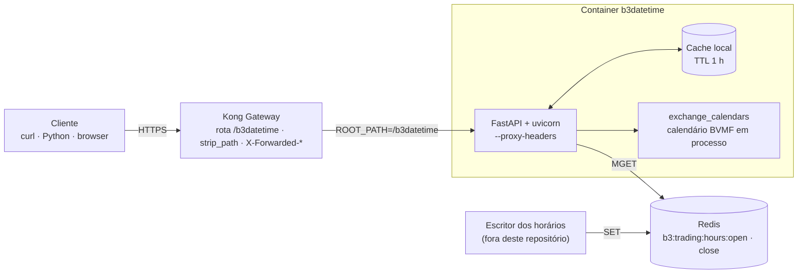
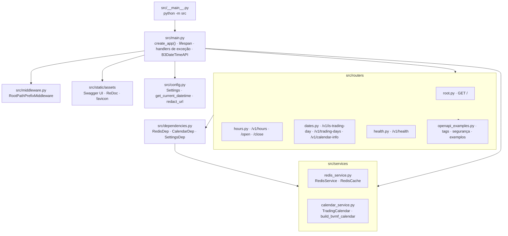
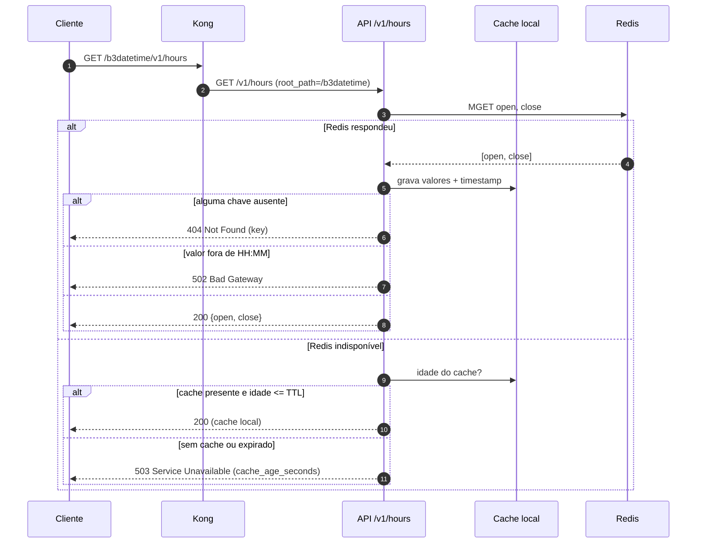
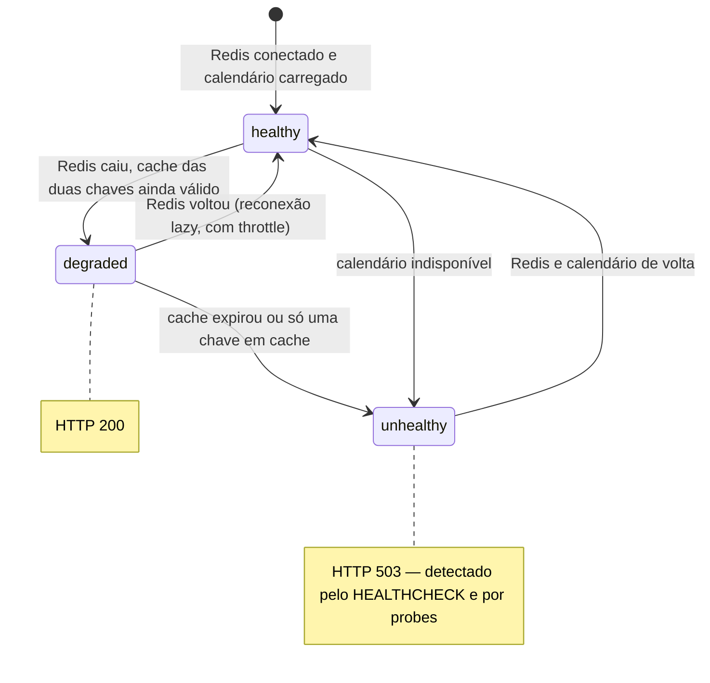
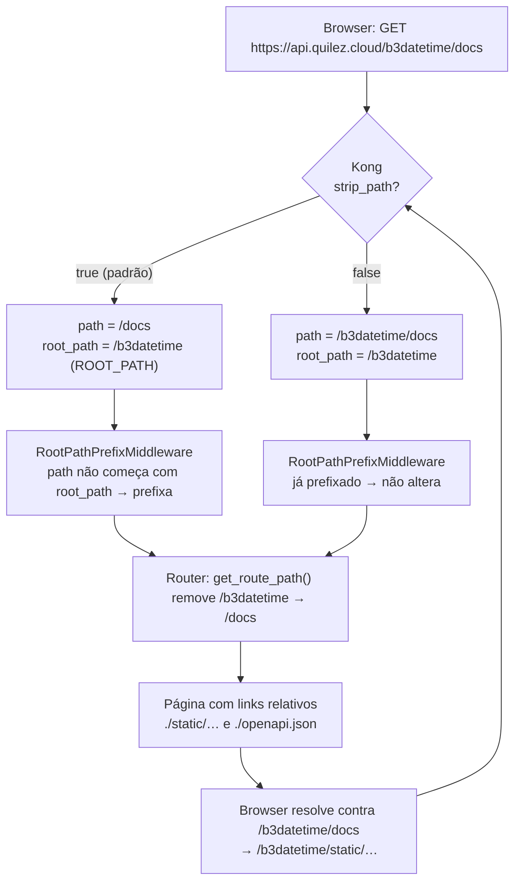
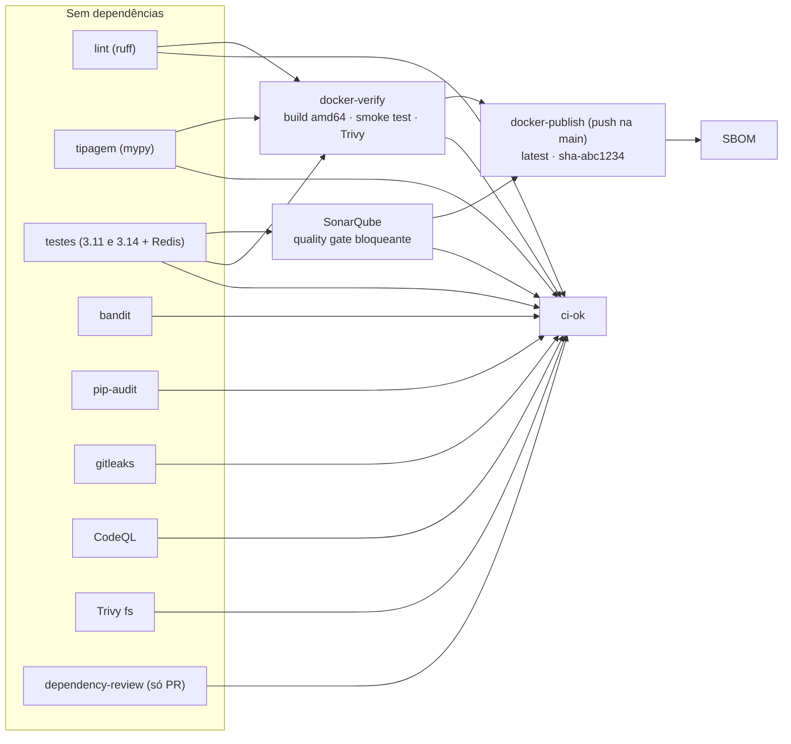
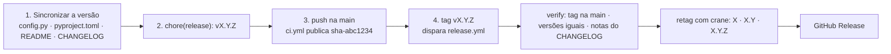

<div align="center">
  

  <h1>B3 DateTime API</h1>

  <p>API REST em Python para consultar horários de operação e dias de negociação da B3 (Bolsa de Valores de São Paulo)</p>

  <p><strong>Versão atual: 2.0.1</strong></p>

  <p>
    <a href="https://api.quilez.cloud/b3datetime/v1/hours"><b>🌐 API em produção</b></a> ·
    <a href="https://api.quilez.cloud/b3datetime/docs"><b>📘 Swagger UI</b></a> ·
    <a href="https://api.quilez.cloud/b3datetime/redoc"><b>📗 ReDoc</b></a> ·
    <a href="https://api.quilez.cloud/b3datetime/openapi.json"><b>🧾 OpenAPI</b></a>
  </p>

  <p>
    <a href="https://github.com/rlquilez/b3datetime/actions/workflows/ci.yml"></a>
    <a href="https://github.com/rlquilez/b3datetime/actions/workflows/release.yml"></a>
    <a href="https://github.com/rlquilez/b3datetime/releases"></a>
    <a href="LICENSE"></a>
    
    
    
    <a href="https://www.conventionalcommits.org/pt-br/"></a>
  </p>
</div>

## 📑 Sumário

- [Visão geral](#-visão-geral)
- [Comece em 30 segundos](#-comece-em-30-segundos)
- [Arquitetura](#️-arquitetura)
- [Endpoints](#-endpoints)
- [Cliente Python completo](#-cliente-python-completo)
- [Autenticação](#-autenticação)
- [Documentação interativa](#-documentação-interativa)
- [Proxy reverso (Kong)](#-proxy-reverso-kong)
- [Configuração](#️-configuração)
- [Cache e fallback](#-cache-e-fallback)
- [Docker](#-docker)
- [Desenvolvimento local](#-desenvolvimento-local)
- [Testes](#-testes)
- [Qualidade e CI/CD](#-qualidade-e-cicd)
- [Versionamento e Release](#️-versionamento-e-release)
- [Segurança](#️-segurança)
- [Limitações e considerações](#-limitações-e-considerações)
- [Migração da v1 para a v2](#-migração-da-v1-para-a-v2)
- [Contribuindo](#-contribuindo)
- [Licença](#-licença)

## 📋 Visão geral

A B3 DateTime API responde, por REST e sem autenticação, às perguntas mais comuns de quem automatiza rotinas ligadas ao pregão da B3:

- **A que horas a bolsa abre e fecha hoje?** — `GET /v1/hours` (lido do Redis, com cache local de 1 h)
- **Hoje tem pregão?** — `GET /v1/is-trading-day`
- **Quais são os dias de pregão (ou os feriados e fins de semana) de um período?** — `GET /v1/trading-days`
- **Que datas o calendário consegue responder?** — `GET /v1/calendar-info`
- **A API e suas dependências estão saudáveis?** — `GET /v1/health`

O calendário é o **BVMF** do [`exchange_calendars`](https://github.com/gerrymanoim/exchange_calendars), construído em processo; os horários vêm do **Redis**, gravados por um processo externo a este repositório. A API roda como imagem Docker atrás do **Kong Gateway**.

| | |
|---|---|
| **Base de produção** | `https://api.quilez.cloud/b3datetime/v1/` |
| **Documentação interativa** | [Swagger UI](https://api.quilez.cloud/b3datetime/docs) · [ReDoc](https://api.quilez.cloud/b3datetime/redoc) · [openapi.json](https://api.quilez.cloud/b3datetime/openapi.json) |
| **Autenticação** | Nenhuma no momento — veja [Autenticação](#-autenticação) |
| **Timezone** | `America/Sao_Paulo` em todas as datas e horas |

## 🚀 Comece em 30 segundos

Sem chave, sem cadastro: basta chamar.

```bash
curl https://api.quilez.cloud/b3datetime/v1/hours
# {"open":"10:00","close":"17:00"}

curl https://api.quilez.cloud/b3datetime/v1/is-trading-day
# {"date":"2026-09-04","is_trading_day":true}
```

```python
import requests

BASE_URL = "https://api.quilez.cloud/b3datetime/v1"

hours = requests.get(f"{BASE_URL}/hours", timeout=10).json()
print(f"Pregão das {hours['open']} às {hours['close']}")

today = requests.get(f"{BASE_URL}/is-trading-day", timeout=10).json()
print("Hoje tem pregão" if today["is_trading_day"] else "Hoje não tem pregão")
```

## 🏗️ Arquitetura

### Visão de contexto



**Características**

- **FastAPI** com documentação Swagger UI e ReDoc servida **localmente** (assets versionados, sem CDN)
- **Redis assíncrono** (`redis.asyncio`), leitura atômica das duas chaves via `MGET` e reconexão automática
- **Cache local** com fallback de até 1 hora quando o Redis está indisponível
- **Exchange Calendars**: calendário oficial BVMF, com janela de cobertura móvel e consultável
- **Proxy-aware**: funciona atrás de um prefixo de gateway nos dois modos do Kong (`strip_path` `true` e `false`)
- **Docker multi-arch** (linux/amd64, linux/arm64), usuário sem privilégios, sem `pip` na imagem
- **CI/CD** com testes em dois Pythons, análise estática, varreduras de segurança, smoke test da imagem real e quality gate bloqueante do SonarQube

### Mapa de módulos



**Nada faz I/O em tempo de import.** Os serviços são construídos no `lifespan` e ficam em `app.state`; os routers os recebem via `Depends`. Uma falha na construção do calendário não derruba o processo: a API sobe, os endpoints de data respondem `503` e `/v1/health` torna o estado visível.

### Leitura dos horários (`/v1/hours`)



### Estados do health check



## 🔌 Endpoints

Base de produção: **`https://api.quilez.cloud/b3datetime`**. Todas as rotas são `GET`, respondem JSON e não têm barra final (`/v1/hours/` responde `404`).

| Rota | Descrição | Códigos |
|------|-----------|---------|
| [`/v1/hours`](https://api.quilez.cloud/b3datetime/v1/hours) | Horários de abertura e fechamento | `200` `404` `502` `503` |
| [`/v1/hours/open`](https://api.quilez.cloud/b3datetime/v1/hours/open) | Só a abertura | `200` `404` `502` `503` |
| [`/v1/hours/close`](https://api.quilez.cloud/b3datetime/v1/hours/close) | Só o fechamento | `200` `404` `502` `503` |
| [`/v1/is-trading-day`](https://api.quilez.cloud/b3datetime/v1/is-trading-day) | Hoje é dia de negociação? | `200` `503` |
| [`/v1/trading-days`](https://api.quilez.cloud/b3datetime/v1/trading-days?start=2026-09-01&end=2026-09-30) | Dias de negociação (ou de não negociação) num período | `200` `400` `422` `503` |
| [`/v1/calendar-info`](https://api.quilez.cloud/b3datetime/v1/calendar-info) | Janela de datas coberta pelo calendário | `200` `503` |
| [`/v1/health`](https://api.quilez.cloud/b3datetime/v1/health) | Saúde da API e das dependências | `200` `503` |
| [`/`](https://api.quilez.cloud/b3datetime/) | Metadados, links e forma de autenticação | `200` |
| [`/docs`](https://api.quilez.cloud/b3datetime/docs) · [`/redoc`](https://api.quilez.cloud/b3datetime/redoc) · [`/openapi.json`](https://api.quilez.cloud/b3datetime/openapi.json) | Documentação interativa e schema OpenAPI | `200` |

### `GET /v1/hours`

Horários de abertura e fechamento. As duas chaves são lidas numa **única operação atômica** (`MGET`), de modo que a resposta nunca combina um horário de abertura antigo com um de fechamento novo.

```bash
curl https://api.quilez.cloud/b3datetime/v1/hours
```

```json
{ "open": "10:00", "close": "17:00" }
```

```python
import requests

BASE_URL = "https://api.quilez.cloud/b3datetime/v1"

resp = requests.get(f"{BASE_URL}/hours", timeout=10)
if resp.status_code == 200:
    hours = resp.json()
    print(f"Abertura {hours['open']}, fechamento {hours['close']}")
elif resp.status_code == 404:
    print("Redis no ar, mas os horários ainda não foram gravados:", resp.json()["detail"]["key"])
elif resp.status_code == 502:
    print("Valor gravado no Redis fora do formato HH:MM")
elif resp.status_code == 503:
    detail = resp.json()["detail"]
    print("Redis indisponível e sem cache válido:", detail["message"])
```

| Código | Situação |
|--------|----------|
| `200` | Valor obtido do Redis, ou do cache local com menos de 1 h |
| `404` | Redis **disponível**, mas a chave não existe — basta um `SET` |
| `502` | O valor armazenado no Redis não está no formato `HH:MM` |
| `503` | Redis indisponível e cache ausente ou expirado (o corpo informa `cache_age_seconds`) |

### `GET /v1/hours/open` · `GET /v1/hours/close`

Retornam apenas um dos horários. Mesmos códigos de `/v1/hours`.

```bash
curl https://api.quilez.cloud/b3datetime/v1/hours/open
# {"time":"10:00"}
curl https://api.quilez.cloud/b3datetime/v1/hours/close
# {"time":"17:00"}
```

```python
import requests

BASE_URL = "https://api.quilez.cloud/b3datetime/v1"

abertura = requests.get(f"{BASE_URL}/hours/open", timeout=10).json()["time"]
fechamento = requests.get(f"{BASE_URL}/hours/close", timeout=10).json()["time"]
print(abertura, fechamento)  # 10:00 17:00
```

### `GET /v1/is-trading-day`

Verifica se **hoje** (no fuso `America/Sao_Paulo`) é dia de negociação na B3, considerando fins de semana e feriados do calendário BVMF.

```bash
curl https://api.quilez.cloud/b3datetime/v1/is-trading-day
```

```json
{ "date": "2026-09-04", "is_trading_day": true }
```

```python
import requests

BASE_URL = "https://api.quilez.cloud/b3datetime/v1"

resp = requests.get(f"{BASE_URL}/is-trading-day", timeout=10)
resp.raise_for_status()  # 503 se a data atual estiver fora da janela do calendário
info = resp.json()
print(f"{info['date']}: {'pregão' if info['is_trading_day'] else 'sem pregão'}")
```

| Código | Situação |
|--------|----------|
| `200` | Verificação feita |
| `503` | Calendário indisponível, ou a data atual está fora da janela — nunca `false`, que seria indistinguível de um feriado legítimo |

### `GET /v1/trading-days`

Lista os dias de negociação (ou, com `exclude=true`, os dias **sem** negociação — fins de semana e feriados) de um período.

**Parâmetros**

| Parâmetro | Obrigatório | Descrição |
|-----------|-------------|-----------|
| `start` | sim | Data inicial, `YYYY-MM-DD` |
| `end` | sim | Data final, `YYYY-MM-DD`, maior ou igual a `start` |
| `exclude` | não | `true` lista os dias **sem** negociação; `false` (padrão) os dias **com** negociação |

**Restrições**

- O período deve estar **inteiramente** dentro da janela do calendário (`GET /v1/calendar-info`). Fora dela, a resposta é `400` — a API não devolve resultado parcial em silêncio.
- O intervalo máximo por requisição é `max_range_days` (3660 dias por padrão). Períodos maiores são rejeitados com `400`.

```bash
# Dias COM negociação em setembro de 2026
curl "https://api.quilez.cloud/b3datetime/v1/trading-days?start=2026-09-01&end=2026-09-30"

# Dias SEM negociação (feriados e finais de semana)
curl "https://api.quilez.cloud/b3datetime/v1/trading-days?start=2026-09-01&end=2026-09-30&exclude=true"
```

```json
["2026-09-01", "2026-09-02", "2026-09-03", "2026-09-04", "2026-09-08", "2026-09-09", "2026-09-10", "2026-09-11", "2026-09-14", "2026-09-15", "2026-09-16", "2026-09-17", "2026-09-18", "2026-09-21", "2026-09-22", "2026-09-23", "2026-09-24", "2026-09-25", "2026-09-28", "2026-09-29", "2026-09-30"]
```

```json
["2026-09-05", "2026-09-06", "2026-09-07", "2026-09-12", "2026-09-13", "2026-09-19", "2026-09-20", "2026-09-26", "2026-09-27"]
```

```python
import requests

BASE_URL = "https://api.quilez.cloud/b3datetime/v1"

resp = requests.get(
    f"{BASE_URL}/trading-days",
    params={"start": "2026-09-01", "end": "2026-09-30"},
    timeout=10,
)
if resp.status_code == 400:
    # end < start, período fora da janela ou intervalo acima do máximo
    raise SystemExit(resp.json()["detail"]["message"])
resp.raise_for_status()  # 422 (data mal formada) e 503 (calendário indisponível)

pregoes = resp.json()
print(f"{len(pregoes)} pregões, o primeiro em {pregoes[0]} e o último em {pregoes[-1]}")

feriados = requests.get(
    f"{BASE_URL}/trading-days",
    params={"start": "2026-09-01", "end": "2026-09-30", "exclude": "true"},
    timeout=10,
).json()
print(f"{len(feriados)} dias sem pregão")
```

| Código | Situação |
|--------|----------|
| `200` | Lista obtida (pode ser vazia, por exemplo num fim de semana com `exclude=false`) |
| `400` | `end` < `start`, período fora da janela, ou intervalo acima do máximo |
| `422` | Formato de data inválido (ex.: `2026-13-01`) ou parâmetro obrigatório ausente |
| `503` | Calendário indisponível |

### `GET /v1/calendar-info`

Janela de datas que o calendário sabe responder. **Consulte este endpoint em vez de assumir uma data mínima fixa**: a janela é móvel (10 anos para trás por padrão) e se desloca conforme o tempo passa.

```bash
curl https://api.quilez.cloud/b3datetime/v1/calendar-info
```

```json
{
  "exchange": "BVMF",
  "coverage_start": "2016-09-04",
  "coverage_end": "2027-09-03",
  "first_session": "2016-09-05",
  "last_session": "2027-09-03",
  "sessions_count": 2730,
  "max_range_days": 3660
}
```

`coverage_*` é o intervalo respondível; `first_session`/`last_session` são o primeiro e o último **pregão** dentro dele. Os dois diferem quando a janela começa num feriado ou fim de semana.

```python
from datetime import date

import requests

BASE_URL = "https://api.quilez.cloud/b3datetime/v1"

info = requests.get(f"{BASE_URL}/calendar-info", timeout=10).json()
inicio = date.fromisoformat(info["coverage_start"])
fim = date.fromisoformat(info["coverage_end"])
print(f"O calendário responde de {inicio} a {fim} ({info['sessions_count']} pregões)")
```

| Código | Situação |
|--------|----------|
| `200` | Limites obtidos |
| `503` | Calendário indisponível ou vazio |

### `GET /v1/health`

| Estado | HTTP | Situação |
|--------|------|----------|
| `healthy` | `200` | Redis conectado e calendário carregado |
| `degraded` | `200` | Redis desconectado, mas **ambas** as chaves têm cache local válido |
| `unhealthy` | **`503`** | Sem cache utilizável, cache expirado, ou calendário indisponível |

O `503` em `unhealthy` é o que permite ao `HEALTHCHECK` do Docker e a probes `httpGet` do Kubernetes detectarem a falha.

```bash
curl https://api.quilez.cloud/b3datetime/v1/health
```

```json
{
  "status": "healthy",
  "timestamp": "2026-09-04T18:54:25.506293-03:00",
  "redis_status": "connected",
  "cache": {
    "redis_connected": true,
    "open_cache_age_seconds": 0,
    "close_cache_age_seconds": 0,
    "open_cache_expired": false,
    "close_cache_expired": false,
    "cache_ttl_seconds": 3600
  },
  "calendar": {
    "available": true,
    "first_session": "2016-09-04",
    "last_session": "2027-09-03",
    "sessions_count": 2730
  }
}
```

```python
import requests

BASE_URL = "https://api.quilez.cloud/b3datetime/v1"

resp = requests.get(f"{BASE_URL}/health", timeout=10)
saude = resp.json()  # o corpo vem nos dois casos, 200 e 503
print(resp.status_code, saude["status"], "| redis:", saude["redis_status"])
```

### `GET /`

Metadados, links para a documentação e para cada endpoint, e a forma de autenticação em vigor. Atrás do gateway os links já vêm com o prefixo.

```bash
curl https://api.quilez.cloud/b3datetime/
```

```json
{
  "name": "B3 DateTime API",
  "version": "2.0.1",
  "description": "API para consultar horários e dias de operação da B3",
  "docs": {
    "swagger": "/b3datetime/docs",
    "redoc": "/b3datetime/redoc",
    "openapi": "/b3datetime/openapi.json"
  },
  "endpoints": {
    "hours": {
      "all": "/b3datetime/v1/hours",
      "open": "/b3datetime/v1/hours/open",
      "close": "/b3datetime/v1/hours/close"
    },
    "dates": {
      "is_trading_day": "/b3datetime/v1/is-trading-day",
      "trading_days": "/b3datetime/v1/trading-days?start=YYYY-MM-DD&end=YYYY-MM-DD&exclude=false",
      "calendar_info": "/b3datetime/v1/calendar-info"
    },
    "health": "/b3datetime/v1/health"
  },
  "authentication": {
    "required": false,
    "type": null,
    "header": null,
    "managed_by": "Kong Gateway"
  }
}
```

## 🐍 Cliente Python completo

Um cliente pequeno, síncrono, que trata os códigos de erro da API e reaproveita a conexão.

<details>
<summary><b>Cliente síncrono com <code>requests</code></b></summary>

```python
"""Cliente mínimo da B3 DateTime API (sem dependências além de requests)."""

from __future__ import annotations

from datetime import date

import requests


class B3DateTimeError(RuntimeError):
    """Erro devolvido pela API, com o código HTTP e a mensagem do corpo."""

    def __init__(self, status: int, message: str) -> None:
        super().__init__(f"HTTP {status}: {message}")
        self.status = status


class B3DateTime:
    def __init__(
        self,
        base_url: str = "https://api.quilez.cloud/b3datetime/v1",
        timeout: float = 10.0,
    ) -> None:
        self.base_url = base_url.rstrip("/")
        self.timeout = timeout
        self.session = requests.Session()

    def _get(self, path: str, **params: str) -> object:
        resp = self.session.get(
            f"{self.base_url}{path}", params=params or None, timeout=self.timeout
        )
        if resp.ok:
            return resp.json()
        detail = resp.json().get("detail", {})
        message = detail.get("message") if isinstance(detail, dict) else str(detail)
        raise B3DateTimeError(resp.status_code, message or resp.reason)

    def hours(self) -> tuple[str, str]:
        """Abertura e fechamento como ("10:00", "17:00")."""
        body = self._get("/hours")
        return body["open"], body["close"]

    def is_trading_day(self) -> bool:
        """Se hoje (America/Sao_Paulo) é dia de negociação."""
        return bool(self._get("/is-trading-day")["is_trading_day"])

    def trading_days(self, start: date, end: date, *, exclude: bool = False) -> list[date]:
        """Dias com negociação no período — ou sem, com exclude=True."""
        body = self._get(
            "/trading-days",
            start=start.isoformat(),
            end=end.isoformat(),
            exclude="true" if exclude else "false",
        )
        return [date.fromisoformat(d) for d in body]

    def calendar_info(self) -> dict:
        """Janela coberta pelo calendário e limites de consulta."""
        return self._get("/calendar-info")


if __name__ == "__main__":
    api = B3DateTime()
    abertura, fechamento = api.hours()
    print(f"Pregão das {abertura} às {fechamento}")
    print("Hoje tem pregão" if api.is_trading_day() else "Hoje não tem pregão")
    pregoes = api.trading_days(date(2026, 9, 1), date(2026, 9, 30))
    print(f"Setembro de 2026 tem {len(pregoes)} pregões")
    try:
        api.trading_days(date(2001, 1, 1), date(2001, 1, 31))
    except B3DateTimeError as exc:
        print("Fora da janela, como esperado:", exc)
```

</details>

<details>
<summary><b>Variante assíncrona com <code>httpx</code></b></summary>

```python
import asyncio
from datetime import date

import httpx

BASE_URL = "https://api.quilez.cloud/b3datetime/v1"


async def main() -> None:
    async with httpx.AsyncClient(base_url=BASE_URL, timeout=10.0) as client:
        hours, today, info = await asyncio.gather(
            client.get("/hours"),
            client.get("/is-trading-day"),
            client.get("/calendar-info"),
        )
        for resp in (hours, today, info):
            resp.raise_for_status()
        print(hours.json(), today.json()["is_trading_day"], info.json()["coverage_end"])

        resp = await client.get(
            "/trading-days",
            params={"start": date(2026, 9, 1).isoformat(), "end": date(2026, 9, 30).isoformat()},
        )
        resp.raise_for_status()
        print(len(resp.json()), "pregões em setembro de 2026")


asyncio.run(main())
```

</details>

## 🔐 Autenticação

**Nenhuma no momento.** As requisições não precisam de header algum:

```bash
curl https://api.quilez.cloud/b3datetime/v1/hours
```

Quando o Kong Gateway passar a exigir o header `apikey` (plugin key-auth), a API é publicada com `API_KEY_REQUIRED=true`: o OpenAPI declara o esquema `ApiKeyAuth`, o Swagger UI exibe **Authorize** e `GET /` informa `authentication.required: true`. **A aplicação não valida chaves** — não há nenhum código de autenticação nela; quem valida é o Kong.

## 📘 Documentação interativa

| Página | URL |
|--------|-----|
| Swagger UI | https://api.quilez.cloud/b3datetime/docs |
| ReDoc | https://api.quilez.cloud/b3datetime/redoc |
| Schema OpenAPI 3.1 | https://api.quilez.cloud/b3datetime/openapi.json |

- Os assets (Swagger UI 5.17.14, ReDoc 2.1.5, favicon) são **versionados em `src/static/assets/` e servidos pela própria API** — sem CDN, sem dependência de rede externa, sem risco de supply chain.
- As páginas referenciam `./static/…` e `./openapi.json` por caminhos **relativos**: o browser os resolve contra a URL pública, o que funciona atrás de qualquer prefixo de gateway.
- `openapi.json` traz `servers: [{"url": "/b3datetime"}]` quando `ROOT_PATH` está definido — é isso que faz o "Try it out" do Swagger chamar `/b3datetime/v1/...`.
- As URLs canônicas não têm barra final: `/docs/` responde `404`, e não um redirect.

## 🌐 Proxy reverso (Kong)

A API é publicada atrás do Kong Gateway sob o prefixo `/b3datetime`, informado à aplicação pela variável `ROOT_PATH`.



- **`ROOT_PATH`** deve conter o prefixo (ex.: `/b3datetime`). Barra final é normalizada. O prefixo não pode coincidir com uma rota da própria API (`/v1`, `/docs`, `/redoc`, `/static`, `/openapi.json`).
- **Os dois modos do Kong funcionam.** Com `strip_path: true` (padrão) o prefixo chega removido e o `RootPathPrefixMiddleware` o recompõe no scope ASGI — o contrato ASGI exige que `path` comece com `root_path`, e o Starlette depende disso para casar rotas montadas; sem a recomposição, `/static/*` respondia `404` e a documentação ficava em branco. Com `strip_path: false` (ou `uvicorn --root-path`) o prefixo já vem no caminho e nada é alterado.
- **Barra final não redireciona**: `/docs/` e `/v1/hours/` respondem `404`. O redirecionamento anterior era montado com o header `Host` recebido do proxy e apontava para o endereço interno do upstream.
- O container roda o uvicorn com `--proxy-headers --forwarded-allow-ips "*"`, para que `X-Forwarded-Proto` e `X-Forwarded-For` sejam respeitados.
- **CORS deve ser configurado em uma única camada.** A aplicação emite CORS permissivo (`GET`/`OPTIONS`, sem credenciais); se o Kong também tiver o plugin de CORS ativo, os headers duplicados fazem o browser rejeitar a resposta.

<details>
<summary><b>Configuração declarativa de referência (Kong 3.x)</b></summary>

```yaml
_format_version: "3.0"
services:
  - name: b3datetime
    url: http://b3datetime:8000        # o container, na rede interna
    routes:
      - name: b3datetime
        paths: ["/b3datetime"]
        strip_path: true               # true ou false: os dois funcionam
        preserve_host: false
    # plugins:
    #   - name: key-auth               # quando for ativado, publique a API com API_KEY_REQUIRED=true
    #     config: { key_names: ["apikey"], hide_credentials: true }
```

Variáveis do container: `ROOT_PATH=/b3datetime` e `REDIS_URL_ENV=redis://<host>:6379`.

</details>

## ⚙️ Configuração

Todas as variáveis são lidas do ambiente (ou de um `.env` local) pelo `pydantic-settings`; nomes são case-insensitive.

| Variável | Descrição | Padrão |
|----------|-----------|--------|
| `REDIS_URL_ENV` | URL de conexão do Redis (nome preferencial) | `redis://localhost:6379` |
| `REDIS_URL` | Alternativa aceita, com precedência **menor** que `REDIS_URL_ENV` | — |
| `REDIS_KEY_OPEN` | Chave Redis do horário de abertura | `b3:trading:hours:open` |
| `REDIS_KEY_CLOSE` | Chave Redis do horário de fechamento | `b3:trading:hours:close` |
| `REDIS_RECONNECT_INTERVAL_SECONDS` | Intervalo mínimo entre tentativas de reconexão | `30` |
| `REDIS_SOCKET_TIMEOUT_SECONDS` | Timeout de socket do Redis | `5` |
| `CACHE_TTL_SECONDS` | Validade do cache local, em segundos | `3600` |
| `TIMEZONE` | Timezone das operações | `America/Sao_Paulo` |
| `EXCHANGE_NAME` | Bolsa do `exchange_calendars` | `BVMF` |
| `CALENDAR_START_OFFSET_YEARS` | Anos para trás na construção do calendário | `10` |
| `MAX_RANGE_DAYS` | Intervalo máximo em `/v1/trading-days` | `3660` |
| `ROOT_PATH` | Prefixo do proxy reverso (ex.: `/b3datetime`) | vazio |
| `API_KEY_REQUIRED` | Só documentação: declara o esquema `apikey` no OpenAPI e em `GET /` | `false` |
| `API_TITLE` | Título exibido na documentação | `B3 DateTime API` |
| `API_DESCRIPTION` | Descrição (Markdown) exibida na documentação | texto padrão |
| `API_VERSION` | Versão anunciada — **não altere**: é sincronizada pela release | `2.0.1` |

`REDIS_URL` é aceito porque é o nome que Heroku, Railway, Render, Fly.io e templates de `docker-compose` injetam automaticamente. Quando as duas estão definidas, **`REDIS_URL_ENV` vence**.

O arquivo [`.env.example`](.env.example) lista todas as variáveis com os valores padrão; `cp .env.example .env` é um ponto de partida seguro.

## 💾 Cache e fallback

1. **Leitura primária**: um único `MGET` no Redis
2. **Cache local**: se o Redis falhar, usa o valor em memória enquanto tiver menos de 1 hora
3. **Erro 503**: Redis indisponível e cache ausente ou expirado

O cliente Redis **nunca é descartado**: se o Redis estiver fora no start do processo e voltar depois, a API se recupera sozinha, sem restart. As tentativas de reconexão são espaçadas por `REDIS_RECONNECT_INTERVAL_SECONDS`, e é o polling de `/v1/health` pelo orquestrador que costuma disparar a recuperação.

## 🐳 Docker

```bash
docker build -t b3datetime:latest .

docker run -d \
  -p 8000:8000 \
  -e REDIS_URL_ENV=redis://redis-host:6379 \
  -e ROOT_PATH=/b3datetime \
  --name b3datetime \
  b3datetime:latest
```

- A imagem é **multi-arch** (linux/amd64 e linux/arm64), roda como usuário sem privilégios (`app`, uid 1001) e não contém `pip`, `setuptools` nem `wheel`.
- O `HEALTHCHECK` consulta `/v1/health` a cada 30 s; como `unhealthy` responde `503`, o Docker marca o container como `unhealthy` de verdade.
- Tags publicadas pelo CI: `latest` (a `main`) e `sha-<7 caracteres>` por commit; a release adiciona `X`, `X.Y` e `X.Y.Z` ao mesmo manifest, sem rebuild.

### Docker Compose

```yaml
services:
  redis:
    image: redis:7.4-alpine
    ports: ["6379:6379"]

  b3datetime:
    build: .
    ports: ["8000:8000"]
    environment:
      - REDIS_URL_ENV=redis://redis:6379
    depends_on: [redis]
```

## 💻 Desenvolvimento local

### Pré-requisitos

- **Python 3.11 ou superior** (a imagem de produção roda **3.14**; a suíte é executada em 3.11 e 3.14)
- Redis (opcional — a suíte de testes usa `fakeredis`)

```bash
git clone https://github.com/rlquilez/b3datetime.git
cd b3datetime

python3.14 -m venv .venv           # qualquer 3.11+ serve
source .venv/bin/activate          # Windows: .venv\Scripts\activate

pip install -r requirements-dev.txt
cp .env.example .env

uvicorn src.main:app --reload --port 8000
# ou: python -m src
```

Documentação local: http://localhost:8000/docs · http://localhost:8000/redoc · http://localhost:8000/openapi.json

Sem um Python 3.11+ instalado, tudo roda em Docker, que também é exatamente o runtime da imagem:

```bash
docker run --rm -v "$PWD":/app -w /app python:3.14-slim bash -c \
  'pip install -q -r requirements-dev.txt && ruff check . && ruff format --check . && mypy src && python -m pytest'
```

### Preparando o Redis

```bash
redis-cli SET b3:trading:hours:open "10:00"
redis-cli SET b3:trading:hours:close "17:00"
```

Se as chaves não existirem, `/v1/hours` responde **404** (e não 503): o Redis está no ar, falta apenas o valor.

### Qualidade

```bash
ruff check .            # lint
ruff format .           # formatação
mypy src                # tipagem
pytest                  # testes + coverage (mínimo de 90%)
pytest -m "not slow"    # pula os testes que constroem o calendário real
```

## 🧪 Testes

A suíte tem cerca de 230 casos e cobre 100% das linhas de `src/`. Ela está organizada em três camadas:

| Diretório | O que cobre | Como |
|-----------|-------------|------|
| `tests/unit/` | `Settings`, `RedisService`/`RedisCache`, `TradingCalendar`, `RootPathPrefixMiddleware`, sincronia da versão | `fakeredis`, relógio injetado (`now_fn`), calendário sintético |
| `tests/api/` | Todos os endpoints e páginas, com cada código de resposta documentado, contrato do OpenAPI, CORS | `httpx.ASGITransport` sobre a app real, sem I/O |
| `tests/integration/` | Semântica do Redis real (string vazia, `decode_responses`, `MGET` parcial) | Redis em `localhost:6379`, **db 15**; pula automaticamente se não houver |

Pontos de desenho que valem conhecer:

- **Três modos de proxy.** A fixture parametrizada `proxy_mode` roda os testes de páginas, assets e endpoints sem proxy, atrás do Kong com `strip_path: true` e com `strip_path: false`; `ProxyMode.upstream()` converte um caminho público no que a aplicação realmente recebe. Foi a ausência dessa parametrização que deixou o `/docs` quebrar em produção com a suíte verde.
- **Assets resolvidos como o browser resolve.** O teste lê os `href`/`src`/`spec-url`/`url` do HTML de `/docs` e `/redoc`, resolve cada um contra a URL pública e exige `200` com o content-type certo.
- **Contrato do OpenAPI derivado das rotas.** O conjunto de `paths` vem de `app.routes`; uma rota nova sem documentação — ou sem entrada na tabela de códigos esperados — falha o teste.
- **`fakeredis`, não um stub.** Um dict devolve `None` onde o Redis real devolve `""`; o `FakeServer.connected` permite simular "o Redis caiu e voltou".
- **Relógio injetado** no `RedisCache`, `freezegun` só no nível da API, `Settings(_env_file=None)` em toda fixture.
- **Smoke test da imagem real.** `scripts/smoke_image.sh` sobe o container construído sem Redis, depois com Redis real e `ROOT_PATH`, e verifica todas as páginas, assets e endpoints nas duas formas de caminho, barra final, casos negativos e o `HEALTHCHECK`. É o mesmo script que o CI executa:

```bash
docker build -t b3datetime:ci . && IMAGE=b3datetime:ci scripts/smoke_image.sh
```

## 🔁 Qualidade e CI/CD

Pipeline em [`.github/workflows/ci.yml`](.github/workflows/ci.yml), disparado em push na `main`, em pull request e manualmente.



| Etapa | Ferramenta | Observação |
|-------|-----------|------------|
| Lint e formatação | ruff | |
| Tipagem | mypy | |
| Testes e coverage | pytest em Python 3.11 (mínimo suportado) e 3.14 (runtime), com Redis real | tripwires: caminhos relativos no `coverage.xml` (senão o Sonar reporta 0%) e nenhum teste pulado |
| SAST | bandit, CodeQL | |
| CVEs em dependências | pip-audit, dependency-review | |
| Segredos | gitleaks | histórico inteiro |
| Filesystem e imagem | Trivy | `CRITICAL`/`HIGH` reprovam |
| Smoke test | `scripts/smoke_image.sh` | container real, com e sem prefixo, Redis real e `HEALTHCHECK` |
| Qualidade | SonarQube | quality gate **bloqueante**: coverage, duplicação e issues em código novo |
| Publicação | imagem multi-arch + SBOM | só em push na `main`, só com tudo verde |

- `ci-ok` é o único check agregador. Nenhuma imagem é publicada sem lint, tipagem, testes, smoke, scan da imagem e quality gate aprovados.
- Em PRs do Dependabot o job do SonarQube é pulado (o PR não recebe os secrets); o restante roda normalmente.
- **Secrets necessários:** `GIT_REGISTRY`, `GIT_OWNER`, `GIT_REGISTRY_USER`, `GIT_REGISTRY_PASSWORD`, `SONAR_TOKEN`, `SONAR_HOST_URL`.

## 🏷️ Versionamento e Release

O projeto segue [SemVer](https://semver.org/lang/pt-BR/) e [Keep a Changelog](https://keepachangelog.com/pt-BR/1.1.0/). A regra que decide o incremento é **"um cliente existente precisa mudar alguma coisa?"** — mudança de código HTTP é MAJOR mesmo quando o código antigo estava errado; endpoint ou campo novo é MINOR; correção sem mudança de contrato é PATCH.

A versão vive em `src/config.py` (`api_version`) e é copiada em três lugares que precisam concordar: `pyproject.toml`, o cabeçalho deste README e a seção do `CHANGELOG.md`. Um teste (`tests/unit/test_config.py`) e o job `verify` de [`release.yml`](.github/workflows/release.yml) impõem a sincronia.



A release **não rebuilda** a imagem: retagueia o manifest `sha-<7>` publicado pelo CI, por isso a tag só pode ser enviada depois que o CI do commit de release terminou. O passo a passo completo está na skill [`release`](.claude/skills/release/SKILL.md).

## 🛡️ Segurança

- **Sem autenticação na aplicação** por desenho: quem valida chaves é o gateway. `API_KEY_REQUIRED` só documenta.
- Imagem com usuário sem privilégios, sem `pip`/`setuptools`/`wheel`, patches do sistema aplicados no build, varrida pelo Trivy a cada CI.
- Assets da documentação versionados e servidos localmente (sem CDN, sem SRI para gerenciar); o diretório servido contém só os assets, nunca código Python.
- CORS sem credenciais e só para métodos de leitura; redirecionamentos que expunham o host interno do upstream foram eliminados.
- A URL do Redis é redigida nos logs (senha nunca aparece); dependências pinadas e auditadas por pip-audit, dependency-review e Dependabot; código analisado por bandit, CodeQL e SonarQube; segredos varridos por gitleaks.
- Encontrou uma vulnerabilidade? Abra um [report privado](https://github.com/rlquilez/b3datetime/security/advisories/new) no GitHub em vez de uma issue pública.

## 📝 Limitações e considerações

- **Janela de datas**: o calendário cobre uma janela móvel (10 anos para trás por padrão). Consulte `GET /v1/calendar-info` — não há data mínima fixa.
- **Intervalo máximo**: `/v1/trading-days` aceita no máximo `MAX_RANGE_DAYS` dias por requisição.
- **Timezone**: todas as operações usam `America/Sao_Paulo`.
- **Cache TTL**: o cache local expira em 1 hora.
- **Horários estáticos**: os horários vindos do Redis não consideram pregões especiais.

## 🔄 Migração da v1 para a v2

A v2.0.0 corrige respostas que antes eram silenciosamente erradas. As mudanças de contrato:

| Endpoint | Antes (v1) | Agora (v2) | Por quê |
|----------|-----------|-----------|---------|
| `/v1/hours*` | `503` quando a chave não existia | **`404`** | O Redis estava no ar; dizer "indisponível" mandava o operador depurar rede e DNS quando faltava um `SET` |
| `/v1/hours*` | `200` com valor fora de `HH:MM` | **`502`** | Valor inválido no Redis não deve ser servido como válido |
| `/v1/health` | `200` mesmo em `unhealthy` | **`503`** em `unhealthy` | Com 200 em todos os estados, o `HEALTHCHECK` e as probes nunca detectavam falha |
| `/v1/health` | `degraded` com cache expirado | `unhealthy` | `/v1/hours` já respondia 503 no mesmo estado; os dois endpoints se contradiziam |
| `/v1/trading-days` | `200 []` fora da janela | **`400`** | Devolvia lista vazia, afirmando que a bolsa não operou no período |
| `/v1/trading-days` | `200` com todos os dias, em `exclude=true` | **`400`** | Marcava o período inteiro como sem negociação |
| `/v1/trading-days` | intervalo ilimitado | **`400`** acima de `MAX_RANGE_DAYS` | Um único request consumia ~77 s de CPU e ~117 MB |
| `/v1/trading-days` | `400` para data mal formada | **`422`** | Convenção do FastAPI para erro de validação |

**Ações necessárias:**
1. Trate `404` e `502` em `/v1/hours*` (antes tudo era `503`).
2. Ajuste monitoramento que dependa de `/v1/health` responder `200` — `unhealthy` agora é `503`.
3. Substitua qualquer data mínima fixa (`2006-01-01`) por uma consulta a `GET /v1/calendar-info`.
4. Divida consultas com intervalo acima de `MAX_RANGE_DAYS`.

## 🤝 Contribuindo

1. **Abra uma Issue** descrevendo contexto, objetivo e critérios de aceite antes de codar.
2. **Commits** seguem [Conventional Commits](https://www.conventionalcommits.org/pt-br/) em português — `feat:`, `fix:`, `docs:`, `test:`, `ci:`, `chore:`, `refactor:`, `style:` — e referenciam a Issue com `Refs #N`.
3. **Barra de qualidade**: `ruff check`, `ruff format --check`, `mypy src` e `pytest` verdes; nenhuma issue nova no SonarQube; toda correção de defeito vem com um teste de regressão nomeado.
4. **Idioma**: docstrings, comentários, textos do OpenAPI e mensagens de commit em pt-BR; identificadores em inglês.
5. **Mudança de contrato** (código HTTP, campo removido ou renomeado) exige entrada `**BREAKING**` no CHANGELOG e guia de migração neste README.

## 📄 Licença

MIT — veja [LICENSE](LICENSE).

## 👤 Autor

Rodrigo Quilez ([@rlquilez](https://github.com/rlquilez))

## 📚 Documentação adicional

- [CHANGELOG.md](CHANGELOG.md)
- [Documentação FastAPI](https://fastapi.tiangolo.com/)
- [Exchange Calendars](https://github.com/gerrymanoim/exchange_calendars)
- [Redis Python Client](https://redis-py.readthedocs.io/)
- [Kong Gateway](https://docs.konghq.com/)
