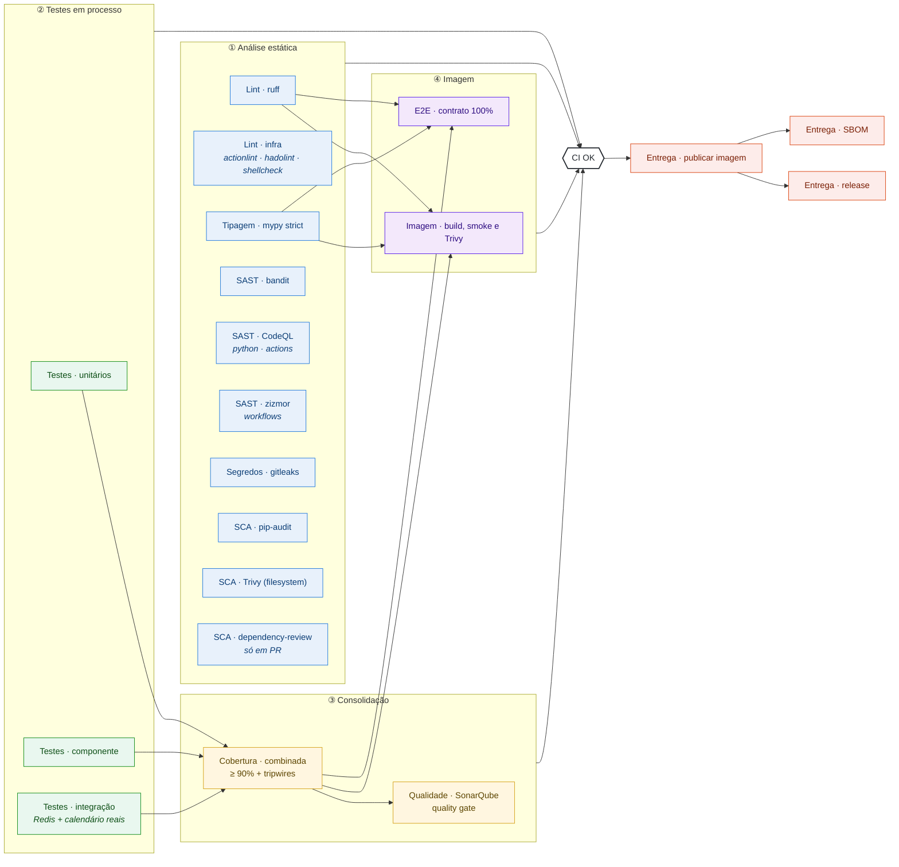

# 🧪 Arquitetura de testes do b3datetime

> Como a qualidade desta API é verificada, **por que** cada camada existe e **onde** cada uma roda no pipeline.
> Este documento é mantido junto com o código: toda mudança na suíte ou no `ci.yml` o atualiza.

## Sumário

- [Visão geral](#visão-geral)
- [O pipeline, bloco a bloco](#o-pipeline-bloco-a-bloco)
- [Blocos](#blocos)
- [Tripwires: provar que o teste rodou](#tripwires-provar-que-o-teste-rodou)
- [Como rodar localmente](#como-rodar-localmente)

## Visão geral

Cada bloco de teste é **um diretório** em `tests/` e **um job** no [`ci.yml`](../.github/workflows/ci.yml), com o nome no padrão `Bloco · ferramenta`. Todos rodam em **todo push na `main`** — não há `paths-ignore` nem bloco opcional — e a imagem só é publicada com **todos** aprovados (o `docker-publish` depende do `CI OK`, que agrega cada bloco).

| Diretório | Bloco | O que prova | Dependências |
|---|---|---|---|
| `tests/unit/` | **Unitários** | regras de cada peça isolada: serviços, calendário, cache, middleware, configuração, os scripts de gate | nenhuma — sem I/O, relógio injetado, `fakeredis`, calendário sintético |
| `tests/api/` | **Componente** | a aplicação ASGI inteira, em processo: cada endpoint, cada código documentado, contrato OpenAPI, proxy, CORS, estáticos | nenhuma — `httpx.ASGITransport`, sem lifespan |
| `tests/integration/` | **Integração** | o encontro com o mundo real: Redis real, calendário BVMF real, lifespan real, a app inteira com tudo real | Redis em `localhost:6379` (db 15) |
| `tests/e2e/` | **E2E** | a **imagem Docker** publicável, caixa-preta: 100% das respostas documentadas, consultas de domínio, documentação, resiliência | Docker (4 ambientes de containers) |

## O pipeline, bloco a bloco



| Estágio | Por que nesta posição |
|---|---|
| ① Estática | Não executa nada da aplicação: é o mais barato e falha mais cedo. Roda em paralelo, sem dependências. |
| ② Em processo | Testes rápidos, sem container. Cada bloco publica a sua cobertura parcial e o seu `junit`. |
| ③ Consolidação | A cobertura só faz sentido somada: o gate de 90% é aplicado **uma vez**, sobre os blocos combinados. O Sonar consome o resultado. |
| ④ Imagem | Só se constrói e se testa a imagem depois de o código passar em processo — testar a imagem de um código que já falhou é desperdício. |
| Gate e entrega | `CI OK` decide; `docker-publish` só roda com ele verde. `release` e `SBOM` vêm depois da publicação. |

## Blocos

### Análise estática

Não executa a aplicação; por isso roda primeiro e em paralelo.

| Job | O que verifica | Por que importa aqui |
|---|---|---|
| Lint · ruff | pyflakes, pycodestyle, bugbear, bandit (`S`), pylint (`PL`), complexidade (mccabe ≤ 10), FastAPI (`FAST`), código comentado (`ERA`), argumentos mortos (`ARG`), `except` cego (`BLE`), `banned-api` | `FAST001` é a mesma regra do Sonar `S8409`; o `banned-api` impede `datetime.now()`/`date.today()` fora de `get_current_datetime()`, que aplica o fuso das settings |
| Lint · infra | actionlint (workflows e o shell de cada `run:`), hadolint (todo `Dockerfile`, limiar `info`), shellcheck (`scripts/*.sh`) | o pipeline e a imagem também são código |
| Tipagem · mypy | `strict` + plugin do pydantic, em `src/`, `scripts/` **e** `tests/` | um teste mal tipado pode estar testando a coisa errada; dublês passam por `as_redis()` (um `cast` documentado), nunca por `# type: ignore` |

| SAST · bandit | padrões inseguros em `src/` (severidade média ou mais reprova) | o motor clássico de Python, com SARIF no code scanning |
| SAST · CodeQL | análise de fluxo de dados em Python e **nos workflows** (`actions`), suíte `security-extended` | o pipeline publica em produção: injeção num `run:` seria execução de código com os secrets do registry |
| SAST · zizmor | auditoria dedicada de GitHub Actions: injeção de template, permissões excessivas, `persist-credentials`, pin por SHA, cache envenenável, gatilhos perigosos, actions com vulnerabilidade conhecida | limpo até no perfil `pedantic`; o que só o perfil `auditor` aponta (secrets fora de *environment*) exigiria configuração no repositório e está registrado como decisão |
| Segredos · gitleaks | o histórico **inteiro** do git | um segredo removido do código continua no histórico |
| SCA · pip-audit / Trivy fs / dependency-review | CVEs nas dependências pinadas, no filesystem (inclui misconfig do `Dockerfile`) e nas dependências que um PR introduz | `CRITICAL`/`HIGH` reprovam |

**Semgrep foi avaliado e não adotado:** seria o quarto motor de SAST para Python, ao lado de CodeQL `security-extended`, Sonar e bandit (mais as regras `S` do ruff), com custo de triagem e sem regra exclusiva relevante para este código.

### Unitários — `tests/unit/`

Sem I/O. Duas armadilhas moldaram o desenho das fixtures (`tests/conftest.py`):

- **Relógio injetado, não remendado.** O `RedisCache` captura a função de tempo na construção; um `monkeypatch` em `get_current_datetime` passaria batido. O `FakeClock` é passado como `now_fn`.
- **`Settings(_env_file=None)` em toda fixture**, para um `.env` local não mudar o resultado.

Inclui a **tabela-verdade completa** do estado do health (64 combinações, `test_health_evaluate.py`), a validação de período chamada direto (`test_validate_range.py`), o oráculo do calendário da B3 (`test_calendario_b3.py`) e os scripts de gate do CI (`test_scripts_*.py`).

### Componente — `tests/api/`

A aplicação real montada por `build_app` (`tests/conftest.py`), com `fakeredis` e o calendário sintético em `app.state`, chamada por `httpx.ASGITransport` — sem lifespan, sem rede.

- **Três formas de proxy** pela fixture `proxy_mode`: sem proxy, Kong com `strip_path: true` e com `strip_path: false`. Foi a ausência dela que deixou o `/docs` quebrar em produção com a suíte verde.
- **Contrato OpenAPI derivado das rotas** (`test_openapi.py`): rota nova sem documentação, ou sem linha em `DOCUMENTED_CODES`, reprova.
- **"Hoje" é o de São Paulo**: entre 00:00 e 03:00 UTC a data UTC já virou e a de SP não (`test_dates.py`).

### Integração — `tests/integration/`

Onde a suíte encontra o mundo real, ainda em processo (a falha aponta a linha e a cobertura conta):

| Arquivo | O que é real |
|---|---|
| `test_redis_contract.py` | a semântica do Redis da qual as correções dependem (`""` ≠ `None`, `decode_responses`, `MGET` parcial) — a defesa contra drift do `fakeredis` |
| `test_calendario_bvmf.py` | o `exchange_calendars` real, de 2017 a 2025: nenhum pregão nos fechamentos da B3, contagem anual plausível, Quarta de Cinzas aberta |
| `test_lifespan.py` | o lifespan real, a app subindo com calendário quebrado e com Redis fora, e o import sem I/O |
| `test_app_real.py` | a app inteira com Redis real, calendário real e lifespan real |

O calendário real é sempre construído com `start`/`end` explícitos: a janela de produção anda todo dia, e um teste preso a ela apodreceria.

### E2E — `tests/e2e/`

Contra a **imagem real**, em quatro ambientes (`principal`, `sem_redis`, `sem_calendario`, `redis_tardio`). Cada par (operação, código) do `/openapi.json` servido tem um caso, e um teste exige que o conjunto coberto seja **igual** ao documentado. As regras do calendário da B3 que servem de oráculo vivem em `tests/e2e/calendario_b3.py` — importáveis sem arrastar o marcador `e2e`, e testadas por si só no bloco unitário.

Com `E2E_BASE_URL`, a mesma suíte roda contra uma API já no ar, só com o que lê.

## Tripwires: provar que o teste rodou

Um teste que deixa de rodar sem ninguém perceber é pior do que um teste que falha. Por isso:

| Tripwire | Onde | O que impede |
|---|---|---|
| Nenhum teste **pulado** em nenhum bloco | `Cobertura · combinada` (`scripts/consolidar_testes.py`) | Redis indisponível transformar a integração em "verde por skip" |
| Nenhum bloco com **zero** testes | idem | um diretório vazio ou um filtro errado passar despercebido |
| Caminhos `src/` no `coverage.xml` | idem | o SonarQube reportar 0% em silêncio |
| Nenhum teste E2E pulado | `E2E · contrato 100%` | uma resposta documentada ficar sem validação |
| Pares cobertos = pares documentados | `tests/e2e/test_contrato.py` | rota ou código novo sem caso E2E |
| `ci-ok` só aceita pulo onde ele é o desenho | `CI OK` | um bloco pulado liberar a publicação |

## Como rodar localmente

O runtime é Python 3.14. Sem um 3.14 no host, use o mesmo base da imagem:

```bash
docker run --rm -v "$PWD":/app -w /app python:3.14-alpine sh -c \
  'pip install -q -r requirements-dev.txt && python -m pytest'
```

Com um 3.14 (por exemplo, `uv venv --python 3.14 .venv`):

```bash
python -m pytest                      # unitários + componente + integração, com o gate de 90%
python -m pytest tests/unit           # um bloco só (a cobertura parcial reprova o gate: use --cov-fail-under=0)
python -m pytest tests/integration    # precisa de Redis em localhost:6379 (db 15) para não pular
docker run -d --rm -p 6379:6379 redis:7.4-alpine   # um Redis descartável para a integração

docker build -t b3datetime:e2e . && E2E_IMAGE=b3datetime:e2e python -m pytest -m e2e tests/e2e --no-cov
```
