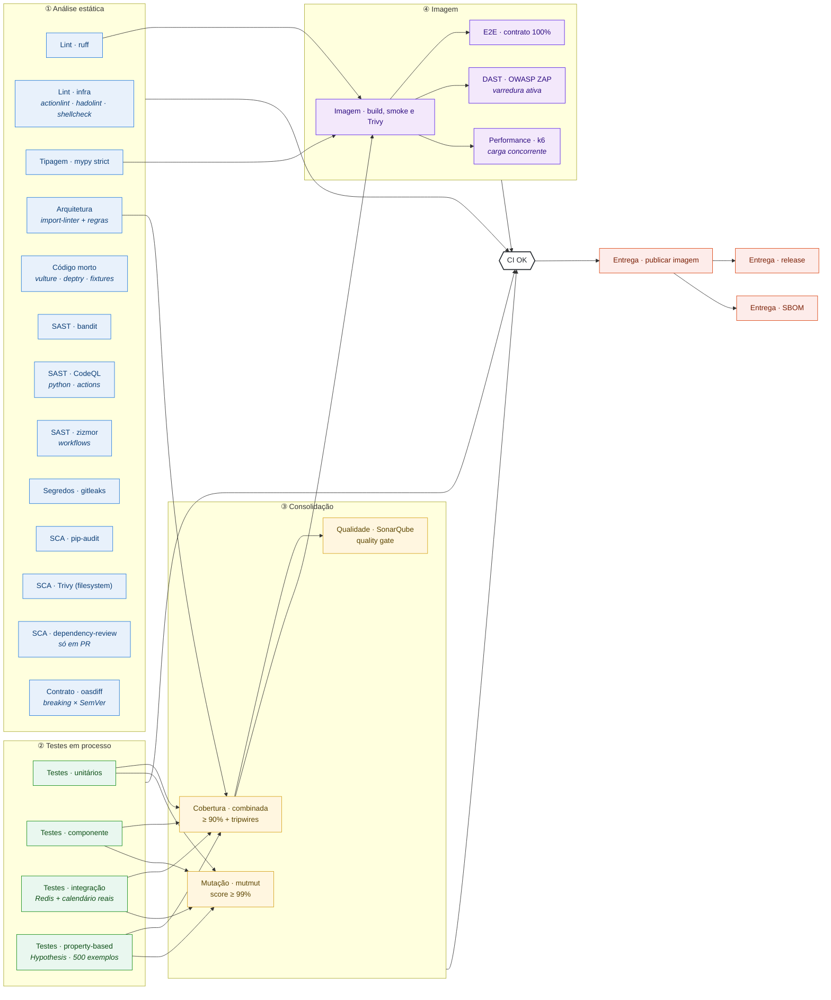
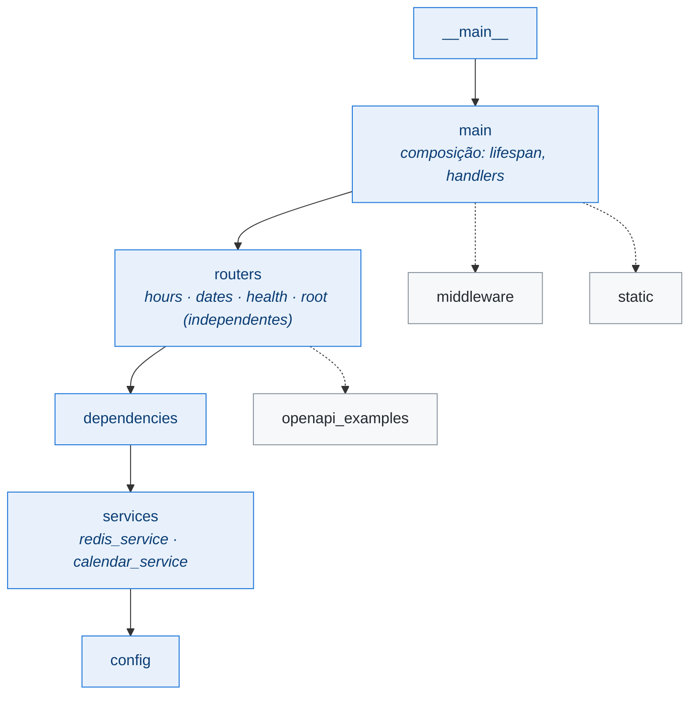
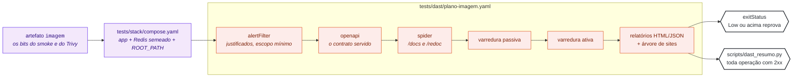
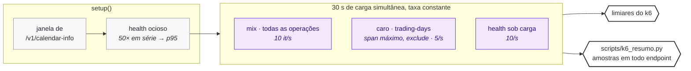

# 🧪 Arquitetura de testes do b3datetime

> Como a qualidade desta API é verificada, **por que** cada camada existe e **onde** cada uma roda no pipeline.
> Este documento é mantido junto com o código: toda mudança na suíte ou no `ci.yml` o atualiza.

## Sumário

- [Visão geral](#visão-geral)
- [O pipeline, bloco a bloco](#o-pipeline-bloco-a-bloco)
- [Blocos](#blocos)
- [Tripwires: provar que o teste rodou](#tripwires-provar-que-o-teste-rodou)
- [Como rodar localmente](#como-rodar-localmente)

## Visão geral

Cada bloco de teste é **um diretório** em `tests/` e **um job** no [`ci.yml`](../.github/workflows/ci.yml), com o nome no padrão `Bloco · ferramenta`. Todos rodam em **todo push na `main`** — não há `paths-ignore` nem bloco opcional — e a imagem só é publicada com **todos** aprovados (o `docker-publish` depende do `CI OK`, que agrega cada bloco).

| Diretório | Bloco | O que prova | Dependências |
|---|---|---|---|
| `tests/unit/` | **Unitários** | regras de cada peça isolada: serviços, calendário, cache, middleware, configuração, os scripts de gate | nenhuma — sem I/O, relógio injetado, `fakeredis`, calendário sintético |
| `tests/api/` | **Componente** | a aplicação ASGI inteira, em processo: cada endpoint, cada código documentado, contrato OpenAPI, proxy, CORS, estáticos | nenhuma — `httpx.ASGITransport`, sem lifespan |
| `tests/integration/` | **Integração** | o encontro com o mundo real: Redis real, calendário BVMF real, lifespan real, a app inteira com tudo real | Redis em `localhost:6379` (db 15) |
| `tests/property/` | **Property-based** | propriedades que valem para **toda** entrada gerada, não só para os exemplos escolhidos: nunca levanta, nunca vaza, é idempotente, preserva o resto | nenhuma — Hypothesis |
| `tests/architecture/` | **Arquitetura** | as regras de desenho: camadas e dependências entre módulos (import-linter), import sem I/O (audit hook) e as convenções do CLAUDE.md sobre a AST | nenhuma |
| `tests/e2e/` | **E2E** | a **imagem Docker** publicável, caixa-preta: 100% das respostas documentadas, consultas de domínio, documentação, resiliência | Docker (4 ambientes de containers) |
| `tests/dast/` | **DAST** | a mesma imagem **sob ataque**: varredura ativa do OWASP ZAP em toda operação do contrato, nas páginas de documentação e nos assets JavaScript vendorizados | Docker (`tests/stack/compose.yaml` + ZAP) |
| `tests/load/` | **Performance** | a mesma imagem **sob carga concorrente**: todas as operações a taxa constante, o pior caso de `/v1/trading-days` em paralelo e o health medido durante os dois | Docker (`tests/stack/compose.yaml` + k6) |

## O pipeline, bloco a bloco



| Estágio | Por que nesta posição |
|---|---|
| ① Estática | Não executa nada da aplicação: é o mais barato e falha mais cedo. Roda em paralelo, sem dependências. |
| ② Em processo | Testes rápidos, sem container. Cada bloco publica a sua cobertura parcial e o seu `junit`. |
| ③ Consolidação | A cobertura só faz sentido somada: o gate de 90% é aplicado **uma vez**, sobre os blocos combinados. O Sonar consome o resultado. |
| ④ Imagem | Só se constrói e se testa a imagem depois de o código passar em processo — testar a imagem de um código que já falhou é desperdício. E2E, DAST e performance carregam o artefato do `docker-verify` e exercitam, em paralelo, exatamente os bits que passaram no smoke e no Trivy. |
| Gate e entrega | `CI OK` decide; `docker-publish` só roda com ele verde. `release` e `SBOM` vêm depois da publicação. |

## Blocos

### Análise estática

Não executa a aplicação; por isso roda primeiro e em paralelo.

| Job | O que verifica | Por que importa aqui |
|---|---|---|
| Lint · ruff | pyflakes, pycodestyle, bugbear, bandit (`S`), pylint (`PL`), complexidade (mccabe ≤ 10), FastAPI (`FAST`), código comentado (`ERA`), argumentos mortos (`ARG`), `except` cego (`BLE`), `banned-api` | `FAST001` é a mesma regra do Sonar `S8409`; o `banned-api` impede `datetime.now()`/`date.today()` fora de `get_current_datetime()`, que aplica o fuso das settings |
| Lint · infra | actionlint (workflows e o shell de cada `run:`), hadolint (todo `Dockerfile`, limiar `info`), shellcheck (`scripts/*.sh`) | o pipeline e a imagem também são código |
| Tipagem · mypy | `strict` + plugin do pydantic, em `src/`, `scripts/` **e** `tests/` | um teste mal tipado pode estar testando a coisa errada; dublês passam por `as_redis()` (um `cast` documentado), nunca por `# type: ignore` |
| SAST · bandit | padrões inseguros em `src/` (severidade média ou mais reprova) | o motor clássico de Python, com SARIF no code scanning |
| SAST · CodeQL | análise de fluxo de dados em Python e **nos workflows** (`actions`), suíte `security-extended` | o pipeline publica em produção: injeção num `run:` seria execução de código com os secrets do registry |
| SAST · zizmor | auditoria dedicada de GitHub Actions: injeção de template, permissões excessivas, `persist-credentials`, pin por SHA, cache envenenável, gatilhos perigosos, actions com vulnerabilidade conhecida | limpo até no perfil `pedantic`; o que só o perfil `auditor` aponta (secrets fora de *environment*) exigiria configuração no repositório e está registrado como decisão |
| Segredos · gitleaks | o histórico **inteiro** do git | um segredo removido do código continua no histórico |
| SCA · pip-audit / Trivy fs / dependency-review | CVEs nas dependências pinadas, no filesystem (inclui misconfig do `Dockerfile`) e nas dependências que um PR introduz | `CRITICAL`/`HIGH` reprovam |
| Contrato · oasdiff | `tests/contract/openapi.json` contra o snapshot da última release | breaking change no contrato só passa com bump de MAJOR — e como todo push vai para produção, a quebra e o bump chegam juntos |

**O contrato é um artefato versionado.** `tests/contract/openapi.json` é o `/openapi.json` que a API serve atrás do Kong, gerado em processo por `scripts/gerar_openapi.py`. Um teste do bloco de componente exige que ele esteja em dia: mudar o contrato sem regenerar reprova, e regenerar faz a mudança aparecer no diff do commit. A sabotagem de referência — remover o campo obrigatório `close` de `/v1/hours` — é barrada pelo oasdiff como `response-required-property-removed`.

**Semgrep foi avaliado e não adotado:** seria o quarto motor de SAST para Python, ao lado de CodeQL `security-extended`, Sonar e bandit (mais as regras `S` do ruff), com custo de triagem e sem regra exclusiva relevante para este código.

### Arquitetura — `tests/architecture/` + `[tool.importlinter]`

O desenho da aplicação, verificado em vez de descrito. Duas camadas:

**Contratos de dependência** (import-linter, `lint-imports`), sobre o grafo de imports:



| Contrato | Regra |
|---|---|
| camadas | `__main__` > `main` > `routers` > `dependencies` > `services` > `config` — só se importa para baixo |
| routers independentes | `hours`, `dates`, `health` e `root` não se importam entre si |
| domínio sem web | `services` e `config` não importam `fastapi`, `starlette` nem `uvicorn` |
| confinamento | `redis` só em `redis_service`; `exchange_calendars`/`pandas` só em `calendar_service`; `uvicorn` só em `__main__` |
| folhas | `middleware`, `static`, `openapi_examples` e `config` não importam nada do pacote |
| sem ciclos | entre módulos irmãos de `b3datetime`, `routers` e `services` |

**Regras que o grafo de imports não alcança** (pytest, `tests/architecture/`):

- `test_import_sem_io.py` — o `import b3datetime.main` roda num subprocesso com `sys.addaudithook`, num diretório com um `.env` plantado: nenhum socket, nenhum subprocesso, nenhum arquivo lido no diretório de trabalho. Prova a invariante "nada faz I/O no import" sem depender de cronômetro;
- `test_convencoes.py` — sobre a AST: nada instancia `Settings`/`create_app` em nível de módulo; nenhum `Depends(get_settings)`; `RedisService` e `build_bvmf_calendar` só são construídos no `lifespan`; modelos de resposta só no router que os declara; todo router está publicado.

Sabotagens de referência: um `import fastapi` em `services` quebra o contrato "domínio sem web"; um `get_settings()` em nível de módulo faz o audit hook apontar a leitura do `.env`.

### Código morto — `tests/dead_code/`

Código que ninguém chama ainda é lido, revisado, mantido e — no caso deste projeto — mutado e coberto. O bloco procura três tipos:

| Ferramenta | O que acha | Configuração |
|---|---|---|
| vulture | funções, classes e atributos sem uso em `src/` (confiança ≥ 60) | `[tool.vulture]`; handlers registrados por decorador são ignorados; `tests/dead_code/vulture_whitelist.py` lista, com o motivo, o que o framework usa e a análise estática não vê (campos Pydantic preenchidos por keyword, a factory chamada pelo nome no `--factory`) |
| deptry | dependência declarada e não usada, usada e não declarada, ou só transitiva | `tests/dead_code/deptry.toml` (fora do `pyproject.toml`: com `[project]` presente, o deptry ignoraria os `requirements*.txt`) |
| pytest-deadfixtures | fixtures que nenhum teste pede | coleta inclusive o E2E (`-m "e2e or not e2e"`), senão as fixtures dele pareceriam órfãs |

O código comentado (o código morto que sobrevive como comentário) é pego pelo ruff (`ERA`).

**O que o bloco removeu ao nascer** (#64): `TradingCalendar._sessions`, um atributo nunca lido que segurava o `DatetimeIndex` inteiro da janela de 10 anos em memória; `RedisCache.get`, `RedisCache.clear` e `RedisService.timezone`, API que só os testes chamavam; a fixture `today_session`; e o literal `favicon.png` duplicado em `main.py` (agora a constante `FAVICON`). As constantes de versão dos assets vendorizados ganharam um teste que as confere contra os próprios arquivos — eram o único registro de versão de bibliotecas JS que nem o Dependabot nem o Trivy enxergam.

### Unitários — `tests/unit/`

Sem I/O. Duas armadilhas moldaram o desenho das fixtures (`tests/conftest.py`):

- **Relógio injetado, não remendado.** O `RedisCache` captura a função de tempo na construção; um `monkeypatch` em `get_current_datetime` passaria batido. O `FakeClock` é passado como `now_fn`.
- **`Settings(_env_file=None)` em toda fixture**, para um `.env` local não mudar o resultado.

Inclui a **tabela-verdade completa** do estado do health (64 combinações, `test_health_evaluate.py`), a validação de período chamada direto (`test_validate_range.py`), o oráculo do calendário da B3 (`test_calendario_b3.py`) e os scripts de gate do CI (`test_scripts_*.py`).

### Componente — `tests/api/`

A aplicação real montada por `build_app` (`tests/conftest.py`), com `fakeredis` e o calendário sintético em `app.state`, chamada por `httpx.ASGITransport` — sem lifespan, sem rede.

- **Três formas de proxy** pela fixture `proxy_mode`: sem proxy, Kong com `strip_path: true` e com `strip_path: false`. Foi a ausência dela que deixou o `/docs` quebrar em produção com a suíte verde.
- **Contrato OpenAPI derivado das rotas** (`test_openapi.py`): rota nova sem documentação, ou sem linha em `DOCUMENTED_CODES`, reprova.
- **"Hoje" é o de São Paulo**: entre 00:00 e 03:00 UTC a data UTC já virou e a de SP não (`test_dates.py`).

### Integração — `tests/integration/`

Onde a suíte encontra o mundo real, ainda em processo (a falha aponta a linha e a cobertura conta):

| Arquivo | O que é real |
|---|---|
| `test_redis_contract.py` | a semântica do Redis da qual as correções dependem (`""` ≠ `None`, `decode_responses`, `MGET` parcial) — a defesa contra drift do `fakeredis` |
| `test_calendario_bvmf.py` | o `exchange_calendars` real, de 2017 a 2025: nenhum pregão nos fechamentos da B3, contagem anual plausível, Quarta de Cinzas aberta |
| `test_lifespan.py` | o lifespan real, a app subindo com calendário quebrado e com Redis fora, e o import sem I/O |
| `test_app_real.py` | a app inteira com Redis real, calendário real e lifespan real |

O calendário real é sempre construído com `start`/`end` explícitos: a janela de produção anda todo dia, e um teste preso a ela apodreceria.

### Property-based — `tests/property/`

Testes por exemplo verificam os casos que alguém lembrou de escrever. Testes por propriedade descrevem o que tem de valer para **qualquer** entrada e deixam o [Hypothesis](https://hypothesis.readthedocs.io/) procurar o contraexemplo — e, quando acha, encolhê-lo até o menor caso que ainda falha.

| Perfil (`HYPOTHESIS_PROFILE`) | Exemplos | Uso |
|---|---|---|
| `dev` (padrão) | 100 | ciclo local |
| `ci` | 500, sem `deadline`, `print_blob` | o job do CI, com `--hypothesis-seed=$GITHUB_RUN_ID`: um re-run reproduz o resultado, cada push explora entradas novas |
| `mutation` | 25, determinístico, sem banco | o teste de mutação: o mesmo mutante é julgado sempre da mesma forma |

**O primeiro bloco já pagou o investimento.** Escrito antes da correção, `test_redact_url.py` reprovou quatro das cinco propriedades da redação da URL do Redis (#58): a função levantava com porta inválida — derrubando o lifespan, que loga a URL — e devolvia **inteiras, com a senha**, as URLs sem host (`redis://:senha@/0`) e com credencial na query (`?password=`). Os doze exemplos que a suíte tinha passavam todos.

| Arquivo | Propriedades |
|---|---|
| `test_redact_url.py` | nunca levanta, nunca vaza (userinfo com e sem host, query), preserva o resto, idempotente |
| `test_horarios.py` | aceito ⇔ `HH:MM` ASCII; `_as_str` identidade/inverso; bytes inválidos → 502 |
| `test_calendario.py` | sessões ⊔ não-sessões = intervalo; `is_session` ⇔ `sessions_in_range`; oráculo de `_validate_range`; Páscoa = `dateutil.easter` |
| `test_middleware.py` | o caminho sempre começa com o prefixo; idempotência; `raw_path` acompanha `path` |
| `test_api_schemathesis.py` | **fuzzing da API inteira pelo contrato** (Schemathesis): para cada operação, requisições válidas e inválidas geradas do OpenAPI; nenhum 5xx, status/content-type/schema conformes, entrada inválida → 4xx, método não suportado → 405 com `Allow` |
| `test_cache_estado.py` | **máquina de estados** (`RuleBasedStateMachine`): idade = tempo real em qualquer fuso; `0.0` ≠ ausente; expirado ⇔ idade > TTL |

O Schemathesis roda em processo sobre a app real, com só o lifespan trocado por um que injeta os dublês. Num run do perfil `ci`, só `/v1/trading-days` recebe ~540 requisições geradas (≈ 165 × `200`, 230 × `400`, 140 × `422`), e toda operação é chamada também com métodos não suportados. A aceitação de dado "positivo" fica desligada em `trading-days`, que responde `400` documentado a períodos válidos pelo schema mas inválidos pelo domínio — regra provada à parte pelo oráculo de `_validate_range`. Marcado `api_fuzz`, fica fora da mutação.

**Uma propriedade só vale o que a estratégia explora.** A primeira versão da máquina de estados sorteava fuso e instante ao acaso e **não pegou** a sabotagem "idade em relógio de parede" (o bug B3, #61): quase nenhuma sequência atravessava uma virada de horário de verão. A versão final começa perto de viradas **reais**, calculadas do tzdata (127, em 6 fusos), e reprova a sabotagem.

`test_horarios.py` trava o padrão `HH:MM`: aceito **se e somente se** está entre os 1440 horários ASCII — gerando quase-horários com dígitos arábico-índicos, devanágari e de largura total, que o `\d` Unicode do pydantic-core deixava passar (#59). Também prova que `_as_str` é a identidade sobre `str`, o inverso de `encode` sobre UTF-8, e que qualquer byte inválido vira o 502 documentado, nunca um 500.

### Mutação — `[tool.mutmut]` + `scripts/mutation_gate.py`

Cobertura diz que uma linha **rodou**; mutação diz se algum teste **perceberia** se ela estivesse errada. O [mutmut](https://github.com/boxed/mutmut) gera centenas de variações do código — `>` vira `>=`, `or` vira `and`, uma string vira `"XX…XX"`, um argumento some — e roda a suíte contra cada uma. Mutante que sobrevive é um defeito que a suíte deixaria passar.

| | Antes (#65) | Depois |
|---|---|---|
| Mutantes | 644 | 733 |
| Mortos | 525 | 730 |
| Sobreviventes | 119 | 3 (equivalentes documentados) |
| **Score** | **81,5%** | **99,59%** |

O job **Mutação · mutmut** é bloqueante: o score (`detectados / avaliados`) não pode ficar abaixo de `[tool.b3datetime.quality] mutation_min_score` (99%, e só sobe). O gate também reprova um run que não avaliou ou não detectou mutante nenhum — o sintoma de uma configuração quebrada.

O que tornou o resultado confiável:

- **o pacote precisou mudar de nome.** O mutmut 3 recusa um pacote chamado `src` (`assert not name.startswith("src.")`); daí o layout `src/b3datetime/` (#52);
- **`--no-cov` na execução da mutação.** Com a cobertura ligada, cada execução parcial reprovaria no `fail_under` e *todo* mutante contaria como morto — um 100% falso;
- **o mutmut não muta funções decoradas.** A lógica dos handlers (`@router.get`) foi extraída para funções comuns (`_dias_do_periodo`, `_montar_health`, `_metadados`…), que a mutação alcança;
- **perfil `mutation` do Hypothesis**, determinístico: o mesmo mutante é julgado sempre do mesmo jeito;
- **fora da seleção, para o veredito depender só do comportamento:** o E2E (imagem); o fuzzing da API inteira (`api_fuzz`, exercita todas as rotas a cada exemplo); a arquitetura (lê o código-fonte, que no diretório da mutação tem os trampolins do mutmut); os testes com asserção de tempo (marcador `tempo`), que estouram com vários processos em paralelo; e a **integração**, porque os processos paralelos dividem o mesmo Redis (db 15) e o `flushdb` de um apagava os dados do outro. Esses dois últimos produziram "mortes" aleatórias — o mesmo mutante morria no Mac e sobrevivia no CI. O que a integração exercitava em `src/` ganhou teste determinístico (o lifespan com dublês, o início da janela móvel com um `exchange_calendars` falso), e dois runs seguidos dão exatamente o mesmo resultado.

Os 3 sobreviventes são equivalentes, mantidos de propósito: `allow_credentials=False` explícito no CORS (é o default do Starlette; trocar por `None` ou omitir dá no mesmo) e `redirect_slashes=False` trocado por `None` (também falso).

**Como os 117 sobreviventes foram tratados.** Cada um foi lido. A maioria revelou testes que só conferiam *trechos* de mensagem — `tests/api/test_respostas_exatas.py` passou a conferir o envelope de erro inteiro — e fronteiras sem teste (idade do cache **igual** ao TTL, reconexão **exatamente** no intervalo). Outros mostraram lógica presa em handlers ou código redundante (um fallback de cobertura que o `TradingCalendar` já fazia, um `setdefault` defensivo), que foi removido. Os **equivalentes** — mudanças que não alteram comportamento observável, como `"utf-8"` → `"UTF-8"` — recebem `# pragma: no mutate` **com a justificativa na mesma linha** (o pragma do mutmut só vale em linha de *statement*, por isso algumas expressões foram reescritas numa linha só). `_example`, que monta os exemplos do health **no import**, fica inteira fora (`no mutate block`): o mutmut ativa o mutante depois do import, e quem verifica o que ela produz é o snapshot do contrato.

### E2E — `tests/e2e/`

Contra a **imagem real**, em quatro ambientes (`principal`, `sem_redis`, `sem_calendario`, `redis_tardio`). Cada par (operação, código) do `/openapi.json` servido tem um caso, e um teste exige que o conjunto coberto seja **igual** ao documentado. As regras do calendário da B3 que servem de oráculo vivem em `tests/e2e/calendario_b3.py` — importáveis sem arrastar o marcador `e2e`, e testadas por si só no bloco unitário.

Roda contra **os bits exatos** que passaram no smoke e no Trivy: o `docker-verify` exporta a imagem como artefato e o E2E a carrega. Inclui `test_exemplos_do_readme.py`, que **executa cada exemplo do README** — os `curl` e os programas Python — trocando só a URL pública pela do ambiente: a documentação não pode mentir sobre como usar a API.

Com `E2E_BASE_URL`, a mesma suíte roda contra uma API já no ar, só com o que lê.

### DAST — `tests/dast/`

SAST e SCA leem código e manifestos; o DAST **ataca a aplicação rodando**. É o único bloco que enxerga três coisas:

- os **assets JavaScript vendorizados** (`src/b3datetime/static/assets/`: Swagger UI e ReDoc). Nenhum manifesto os declara, então nem o Dependabot nem o Trivy sabem que existem;
- o comportamento HTTP da imagem diante de entrada hostil: injeção, *path traversal*, divulgação de informação, respostas de erro;
- os headers de segurança das respostas.

**Já pagou o investimento na primeira varredura.** O Swagger UI 5.17.14 servido em `/docs` embutia o **DOMPurify 3.1.4**, com 19 CVEs de XSS conhecidos. O ZAP o apontou pela regra 10003 (*Vulnerable JS Library*, base do retire.js), e os assets foram atualizados para Swagger UI 5.33.0 e ReDoc 2.5.4 (#69).



| Peça | Papel |
|---|---|
| `tests/dast/Dockerfile` | fixa o ZAP por versão **e digest**; o Dependabot (`docker`, `/tests/dast`) propõe os novos |
| `tests/dast/plano-imagem.yaml` | o plano do Automation Framework, com cada decisão comentada |
| `tests/stack/compose.yaml` | o alvo: a imagem verificada, Redis semeado (`10:00`/`17:00`) e `ROOT_PATH=/b3datetime`, o formato que o Kong entrega |
| `scripts/dast_resumo.py` | o tripwire de cobertura, um veredito por risco independente do ZAP e o resumo do job |

**Filtros: só com justificativa e com o menor escopo possível.** Um alerta novo, de qualquer outra regra ou URL, reprova o job.

| Regra | Tratamento | Por quê |
|---|---|---|
| 10038 CSP · 10020 anti-clickjacking · 10021 `nosniff` | rebaixadas a **Info**: continuam no relatório | os headers de segurança são da **borda** (Cloudflare), por decisão de projeto; um dono só evita headers duplicados ou divergentes. A presença deles em produção é verificada pelo job de pós-deploy |
| 10096 *Timestamp Disclosure* | falso positivo, só em `/static/*.js` | são constantes de 10 dígitos do JavaScript minificado, não timestamps do servidor |
| 2 *Private IP Disclosure* | falso positivo, só em `redoc.standalone.js` | o gerador de exemplos do ReDoc devolve o literal `192.168.0.1` para campos `format: ipv4` |

**Uma varredura vale o que ela alcança.** Na primeira versão, o ZAP importava `/v1/trading-days` do OpenAPI com o próprio nome do parâmetro como valor (`start=start&end=end`). Toda requisição, inclusive as de ataque, morria no `422` da validação, e a lógica do endpoint nunca era exercitada, sem alerta nenhum. Por isso:

- os parâmetros `start`/`end` ganharam **exemplos no contrato** (2026-09-01 a 2026-09-07). Esse é exatamente o período cujas respostas são os dois exemplos de `200` já documentados, e `tests/integration/test_calendario_bvmf.py` trava o par. O *Try it out* do `/docs` também ganhou com isso;
- o tripwire exige que **toda operação do contrato** apareça na árvore de sites do ZAP **com resposta 2xx**. Hoje: 8 de 8.

**Sem SARIF no code scanning, de propósito.** Os alertas informativos de header virariam alertas abertos permanentes na aba Security. O relatório HTML/JSON fica no artefato `dast-report`, e a tabela de alertas vai para o resumo do job.

**Ativo só no CI.** A varredura ativa envia milhares de requisições hostis, então só roda contra o container efêmero do job, nunca contra produção. Em produção, o pós-deploy faz apenas uma checagem passiva.

Sabotagem de referência: com os filtros movidos para depois da varredura, eles não se aplicam aos alertas já levantados, e o `exitStatus` reprova (`An alert has been raised with a risk of at least: Low`). Com os assets antigos, a 10003 reprova.

### Performance — `tests/load/`

O teste de escala em processo (`tests/api/test_performance.py`) prova que `/v1/trading-days` não voltou a ser quadrático, mas roda uma requisição por vez. Uma classe de regressão só aparece com **várias requisições simultâneas** contra o servidor real, de um único worker do uvicorn:

- uma chamada **bloqueante** dentro de um handler `async` (I/O síncrono, `time.sleep`, CPU pesado) congela o event loop — e com ele o `/v1/health` que o orquestrador consulta;
- 5xx ou conexão recusada sob concorrência;
- vazão abaixo do mínimo.

O [k6](https://grafana.com/docs/k6/) roda `tests/load/smoke.js` contra a imagem verificada, na rede de `tests/stack/compose.yaml`:



| Limiar | Valor | O que pega |
|---|---|---|
| `http_req_failed` | `== 0` | qualquer erro HTTP ou de conexão |
| `checks` | `== 100%` | status diferente de `200` ou corpo que não é JSON |
| `dropped_iterations` | `== 0` | a taxa constante não foi sustentada |
| p95 por endpoint | `< 250 ms` (caro: `< 750 ms`) | regressão grosseira de latência; localmente todos respondem em 1–14 ms |
| health sob carga | p95 `< 5×` o ocioso do mesmo run, com piso de 10 ms | event loop bloqueado. Ser **relativo** tolera um runner lento, mas não um loop parado |

**Visto reprovando.** Uma imagem sabotada com `time.sleep(0.1)` no cálculo do período cruza 10 limiares: health 217× o ocioso, p95 de 1,2 a 2,2 s e 155 iterações descartadas (exit 99). A imagem real sustenta ~97 req/s com p95 ≤ 14 ms e health sob carga a 1,4× o ocioso.

**A suspeita que não se confirmou.** O plano previa que `get_trading_days` (`async def`, com CPU no event loop) degradaria o health e teria de virar `def`, rodando no threadpool. Medido, o pior caso (span máximo com `exclude=true`) custa 3–8 ms e o health sob carga fica em 1,4× o ocioso. Não houve mudança, e o próprio k6 é o alarme se isso mudar.

**Tripwires.**
- `scripts/k6_resumo.py` exige **amostras** em todo endpoint. Um limiar de p95 sobre um endpoint que nunca foi chamado passa em silêncio, porque o p95 de nada é zero.
- O script também reprova qualquer limiar cruzado, de forma independente.
- `tests/unit/test_scripts_k6_resumo.py` exige que o `ENDPOINTS` do script cubra exatamente as operações do contrato: um endpoint novo sem cenário de carga reprova antes do CI.

O k6 (2.3.0) fica fixado por digest em `tests/load/Dockerfile`, no mesmo padrão do ZAP, com Dependabot em `/tests/load`. Os actions `grafana/setup-k6-action` e `run-k6-action` seriam dois actions a mais para pinar e auditar. O script fica fora do Sonar (`sonar.test.exclusions`): é JavaScript do runtime do k6, com globais como `__ENV`, e quem o valida é o próprio k6 a cada run.

## Tripwires: provar que o teste rodou

Um teste que deixa de rodar sem ninguém perceber é pior do que um teste que falha. Por isso:

| Tripwire | Onde | O que impede |
|---|---|---|
| Nenhum teste **pulado** em nenhum bloco | `Cobertura · combinada` (`scripts/consolidar_testes.py`) | Redis indisponível transformar a integração em "verde por skip" |
| Nenhum bloco com **zero** testes | idem | um diretório vazio ou um filtro errado passar despercebido |
| Caminhos `src/` no `coverage.xml` | idem | o SonarQube reportar 0% em silêncio |
| Nenhum teste E2E pulado | `E2E · contrato 100%` | uma resposta documentada ficar sem validação |
| Pares cobertos = pares documentados | `tests/e2e/test_contrato.py` | rota ou código novo sem caso E2E |
| `ci-ok` só aceita pulo onde ele é o desenho | `CI OK` | um bloco pulado liberar a publicação |
| Toda operação do contrato alcançada com **2xx** pela varredura | `DAST · OWASP ZAP` (`scripts/dast_resumo.py`) | o ZAP "passar" sem ter atacado a lógica — como no `422` de `/v1/trading-days` |
| Todo endpoint do contrato com cenário **e** com amostras na carga | `Performance · k6` (`scripts/k6_resumo.py`) e `tests/unit/test_scripts_k6_resumo.py` | um limiar de p95 passar sobre um endpoint que nunca foi chamado |
| Todo arquivo do repositório lido pelos testes está no sandbox da mutação | `tests/architecture/test_convencoes.py` | a execução limpa do mutmut reprovar e derrubar o job antes de avaliar mutante algum (o push de #67) |
| Toda imagem base fixada por digest e acompanhada pelo Dependabot | `tests/unit/test_imagens_fixadas.py` | uma tag mutável trocar a imagem sem commit, ou um digest fixo congelar as correções de segurança |

## Como rodar localmente

O runtime é Python 3.14. Sem um 3.14 no host, use o mesmo base da imagem:

```bash
docker run --rm -v "$PWD":/app -w /app python:3.14-alpine sh -c \
  'pip install -q -r requirements-dev.txt && python -m pytest'
```

Com um 3.14 (por exemplo, `uv venv --python 3.14 .venv`):

```bash
python -m pytest                      # unitários + componente + integração, com o gate de 90%
python -m pytest tests/unit           # um bloco só (a cobertura parcial reprova o gate: use --cov-fail-under=0)
python -m pytest tests/integration    # precisa de Redis em localhost:6379 (db 15) para não pular
HYPOTHESIS_PROFILE=ci python -m pytest tests/property --cov-fail-under=0   # como no CI (500 exemplos)
HYPOTHESIS_PROFILE=mutation mutmut run && mutmut results   # mutação (sem Redis: a integração fica fora da seleção)
mutmut export-cicd-stats && mutmut results > s.txt && python scripts/mutation_gate.py mutants/mutmut-cicd-stats.json s.txt
docker run -d --rm -p 6379:6379 redis:8.10-alpine   # um Redis descartável para a integração

docker build -t b3datetime:e2e . && E2E_IMAGE=b3datetime:e2e python -m pytest -m e2e tests/e2e --no-cov
```

DAST e performance, como no CI (o ZAP leva ~3 min, dos quais ~2 de varredura ativa; o k6, ~35 s):

```bash
docker build -t b3datetime:ci . && IMAGE=b3datetime:ci docker compose -f tests/stack/compose.yaml up -d --wait
docker build -t b3datetime-zap tests/dast && mkdir -p zap && chmod 777 zap
docker run --rm --network b3stack_default -v "$PWD/tests/dast:/zap/plano:ro" -v "$PWD/zap:/zap/wrk:rw" \
  b3datetime-zap zap.sh -cmd -autorun /zap/plano/plano-imagem.yaml
python scripts/dast_resumo.py zap/zap.json zap/arvore.yaml tests/contract/openapi.json
docker build -t b3datetime-k6 tests/load && mkdir -p k6 && chmod 777 k6
docker run --rm --network b3stack_default -v "$PWD/tests/load:/scripts:ro" -v "$PWD/k6:/out:rw" \
  b3datetime-k6 run --quiet --summary-export=/out/k6.json /scripts/smoke.js
python scripts/k6_resumo.py k6/k6.json tests/load/smoke.js tests/contract/openapi.json
IMAGE=b3datetime:ci docker compose -f tests/stack/compose.yaml down -v
```
